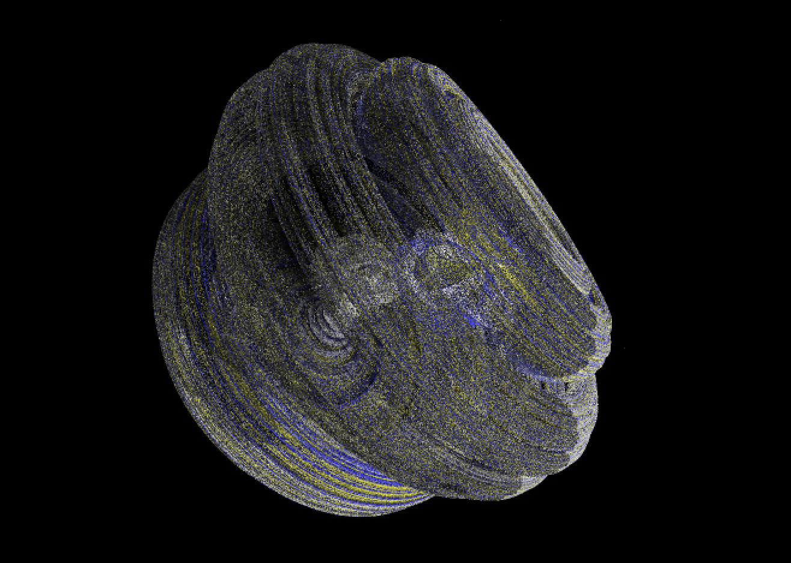
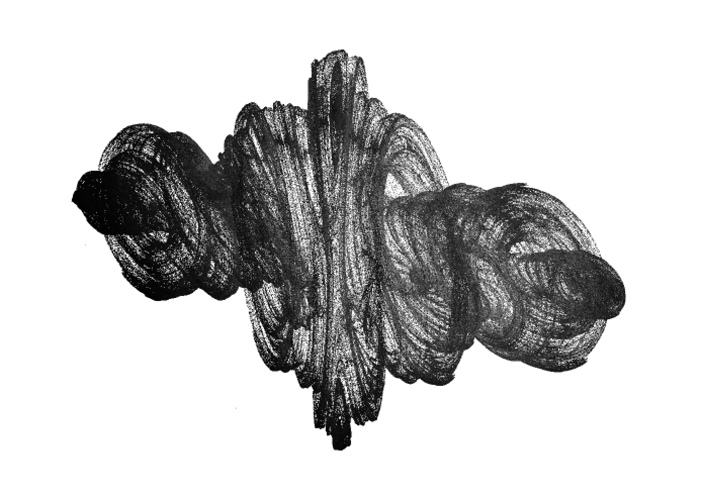

# 3D Reversed Julia Set IFS

## Build + Run:

```bash
cargo run --release
```

## Examples

<p float="left">
  
  
</p>

## How it Works

- **IFS (Iterated Function Systems)**: A point in 3D space is repeatedly transformed by randomly chosen affine maps. After a short burn-in, iterates converge toward attractors that trace the fractal shape.
- **Multiple sets**: A, B, C, D, E, D3, plus 2D variants—each set uses different transformation formulas. X-modes (2X, 3X, 4X, etc.) add symmetry via coordinate flips.
- **Progressive rendering**: Each frame adds 512 fractal + 128 bottom-plane iterations.
- **Shadow mapping**: A separate light-space depth buffer renders shadows. Points occluded from the light are dimmed; a small backstep offset creates soft shadow edges.
- **Projection**: 3D world coordinates are projected to 2D via camera and light transforms. Z-buffer depth testing resolves visibility.

Original project page (archived):
`https://web.archive.org/web/20080617054001/http://web.comhem.se/solgrop/3djulia.htm`